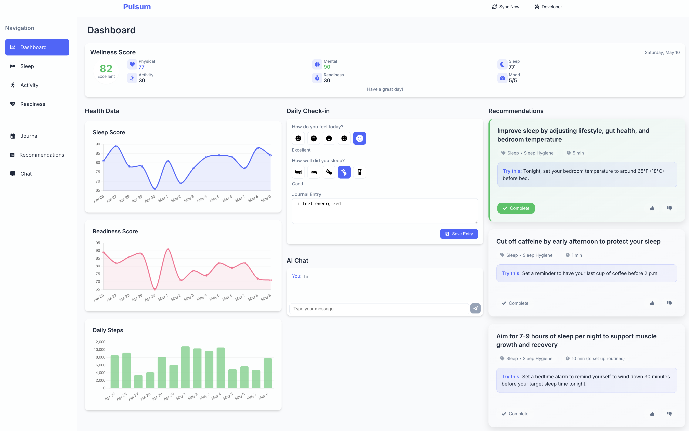

# Deep Learning & AI Portfolio

## Overview
This repository showcases my comprehensive exploration in deep learning and artificial intelligence, featuring projects in generative AI, transformer models, NLP, and multi-agent systems. The portfolio demonstrates both theoretical understanding and practical implementation of cutting-edge AI technologies.

## Repository Structure
- **Midterm Project**: Creating Images with Diffusion Models
- **Final Project**: Pulsum Wellness Multi-Agent Application
- **Labs & Assignments**: Various explorations of deep learning concepts, frameworks, and practical implementations

## Key Projects

### Diffusion Models for Image Generation
Implemented a U-Net architecture diffusion model to generate MNIST handwritten digits, with progressive improvements by adjusting diffusion steps from 100 to 500. This project provided hands-on experience with:
- Noise scheduling and systematic denoising
- Generative AI implementation in PyTorch
- Model performance tuning and optimization

### Pulsum Wellness Multi-Agent System
Developed a comprehensive wellness application leveraging multiple specialized AI agents to:
- Integrate and analyze real-time Oura health data
- Perform sentiment analysis on user feedback
- Detect patterns in health metrics
- Generate personalized micro-action recommendations
- Provide conversational AI interactions

Technologies used: Python (FastAPI), React, SQLite, and multiple AI agent architectures.

### BERT Fine-Tuning for Sentiment Analysis
Adapted and fine-tuned BERT models for specialized sentiment analysis tasks, exploring the capabilities of transformer architectures for NLP applications.

## Technologies & Frameworks
- **Deep Learning Frameworks**: PyTorch, TensorFlow
- **Cloud Services**: AWS Machine Learning University labs, Azure AI services
- **AI Architectures**: CNNs, Transformers, U-Net, Diffusion Models
- **Development Tools**: Python, Jupyter Notebooks, React

## Skills Developed
- Deep Learning model implementation and training
- Generative AI and diffusion models
- Transformer models and BERT fine-tuning
- NLP and sentiment analysis
- Multi-agent system architecture design
- Real-time data integration
- Practical AI implementation and troubleshooting

## Learning Journey Highlights
Throughout this portfolio, I progressed from foundational concepts to advanced implementations, gaining valuable insights into:
- Precise model tuning techniques
- Performance optimization strategies
- Effective noise scheduling in generative models
- Orchestrating specialized AI agents for personalized user experiences

## Repository Access
Complete projects and code available at: [https://github.com/martindemel/ITAI2376-Deep-Learning](https://github.com/martindemel/ITAI2376-Deep-Learning) 